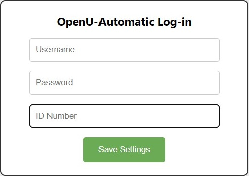

# OpenU-AutoLogin
This extension allows you to save your login information locally so that everytime that you try to enter the Open University's website it you are being automatically logged in.

_**Please notice that your login information is not being saved in an encrypted manner!**_

# Installation:
Download the source code, then go to chrome://extensions, and then click on "Load unpacked extension" using the path in which you stored the source code.

# Usage:
Go to the extension's options page and fill out your login information, then hit on "Save settings" button

---
Enjoy!

Created by: Shlomi Levi

GitHub: [@shlomi-levi](https://github.com/shlomi-levi)
